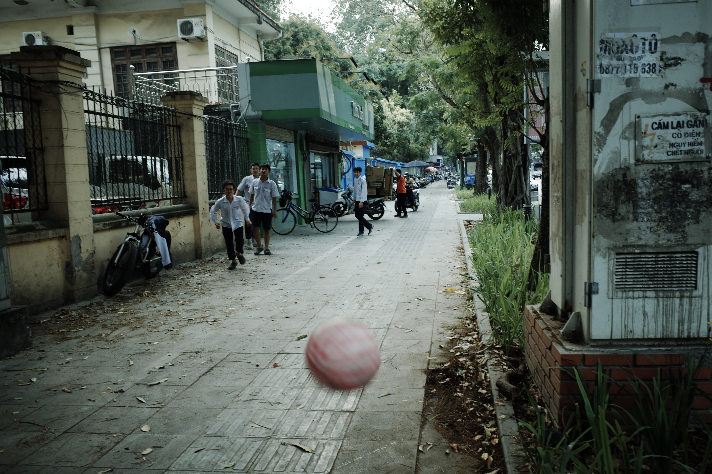
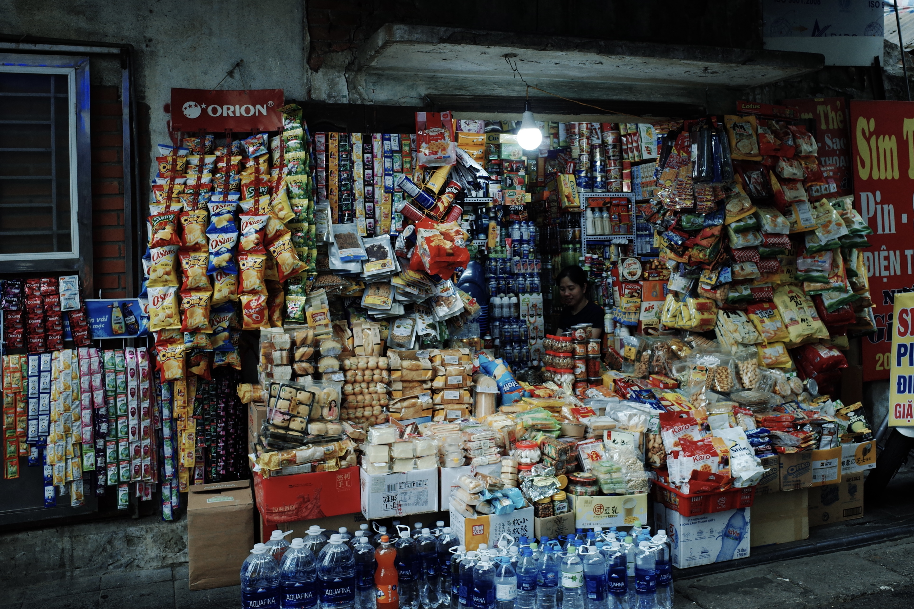
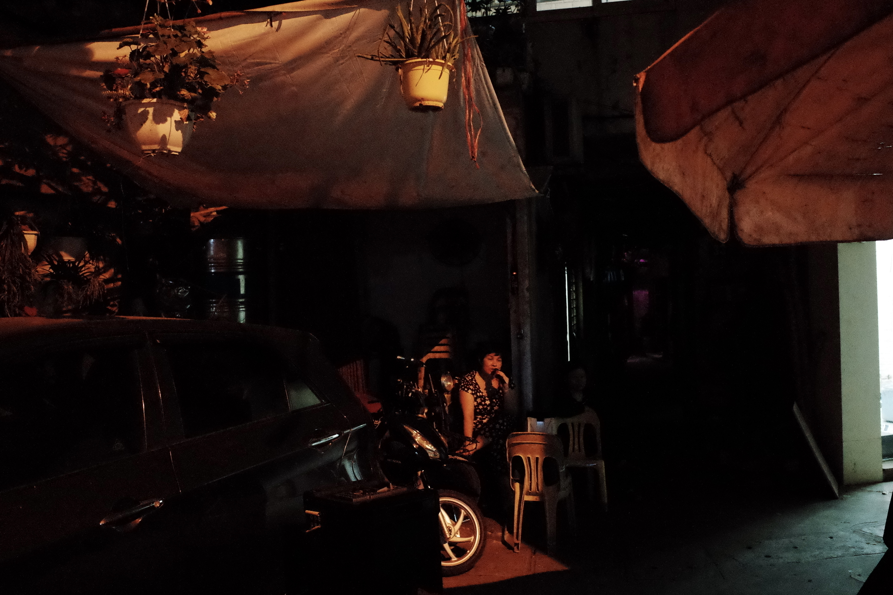
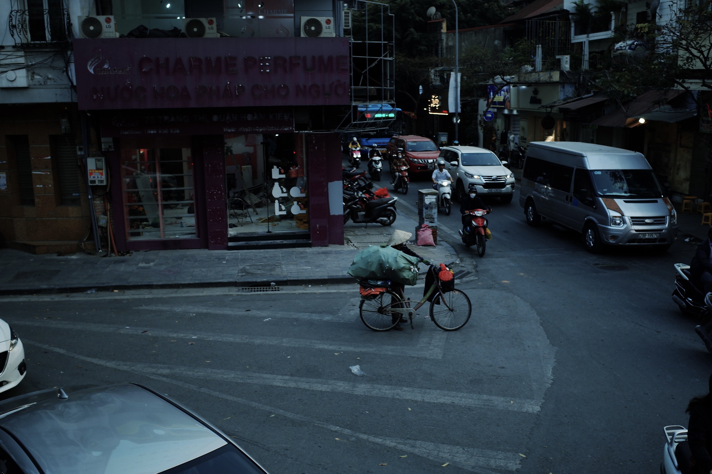
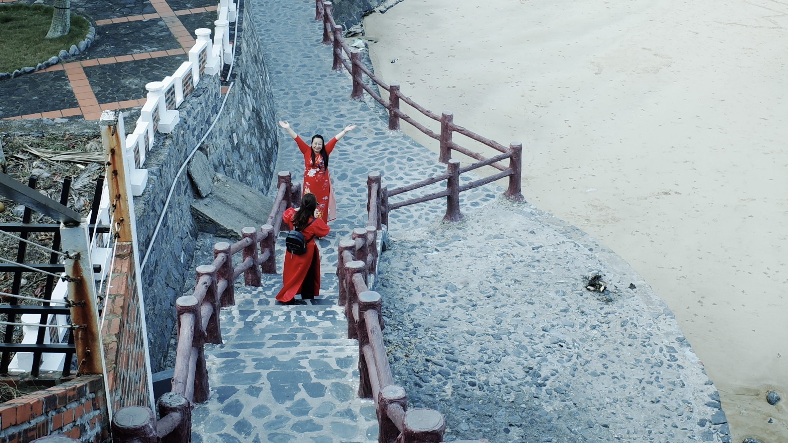
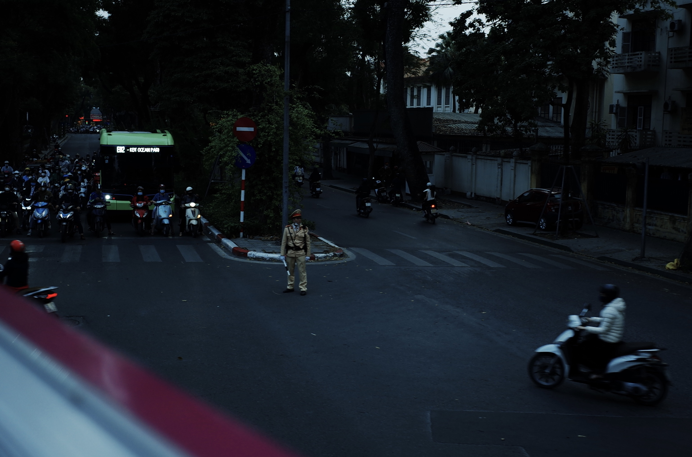

# 越南碎片

<link href="/css/nanogallery2.min.css" rel="stylesheet" type="text/css">
<link href="/css/nanogallery2.woff.min.css" rel="stylesheet" type="text/css">

    
    
    
    
    
    
    
    
    
    
    
    
    
    
    
    
    
    
    
    
    
    
    
    
    
    
    
    
    
    
    
    
    
    
    

